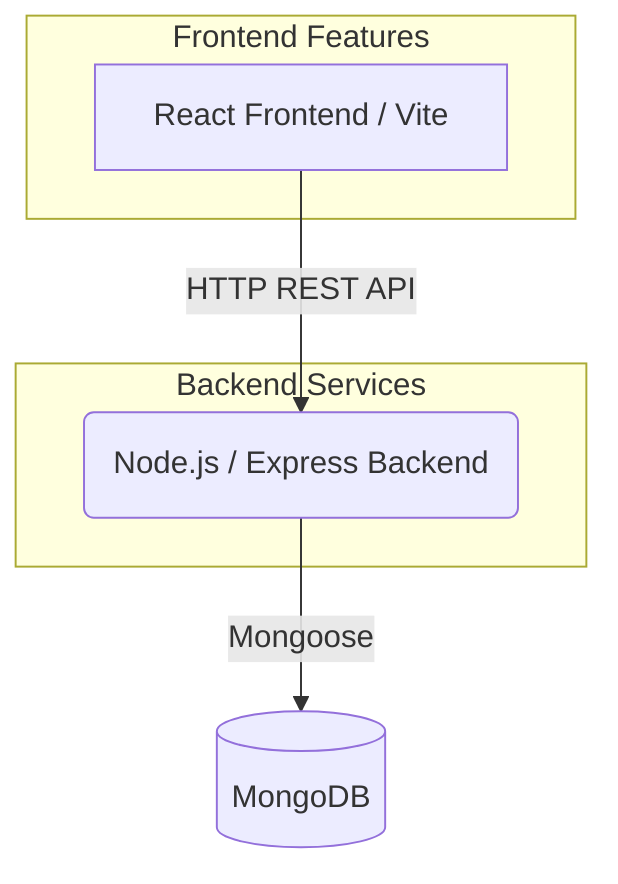
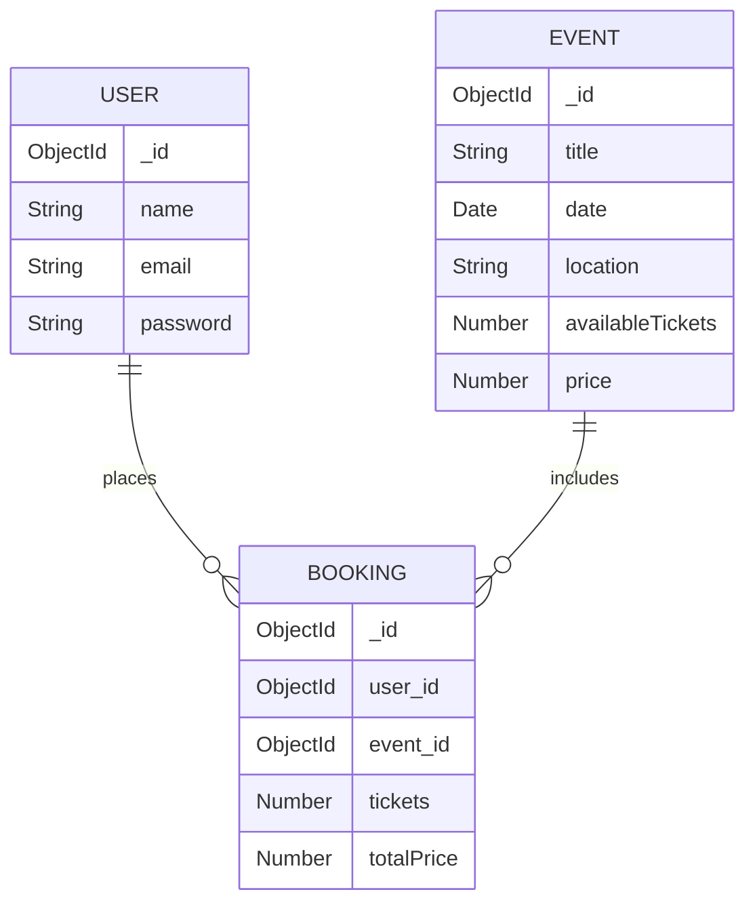

# Event Ticket Booking Application

A full-stack application for browsing, booking, and managing event tickets.

## Project Structure

This is a monorepo consisting of two main directories:

- `/backend`: The server-side API application built using **Node.js, Express, and MongoDB**.
- `/ticket-booking`: The client-side application built using **React, Vite, and React Router**.

## System Architecture



## Technologies

### Frontend
- **React (v19)**: UI library
- **Vite**: Fast frontend tooling and bundler
- **React Router**: Client-side routing for navigating between pages like events, details, booking, and user profiles.

### Backend
- **Node.js & Express**: API framework providing endpoints for routing.
- **MongoDB & Mongoose**: Database and ODM for persisting events, user profiles, and ticket bookings.
- **CORS**: Cross-origin resource sharing enablement.
- **dotenv**: Environment variable management.

## Database Schema



## Features
- **Event Catalog**: Browse a wide array of existing events and details.
- **Ticket Booking System**: Reserve and confirm seats for upcoming events.
- **User Authentication**: Secure sign-up, login, and user profile management.
- **Order History**: Keep track of previous and current ticket reservations.

## How to Run Locally

### 1. Prerequisites
- [Node.js](https://nodejs.org/en/) installed on your machine
- [MongoDB](https://www.mongodb.com/) instance running (either locally or MongoDB Atlas). 

### 2. Setup Backend
```bash
cd backend
npm install
```
Configure `.env` file with necessary variables (e.g. `PORT`, `MONGO_URI`). Wait for the database connection and verify the server starts.
```bash
node server.js
```

### 3. Setup Frontend
```bash
cd ticket-booking
npm install
```
Start the development server:
```bash
npm run dev
```

Visit the `localhost` link provided in the terminal to view the application in your browser.
